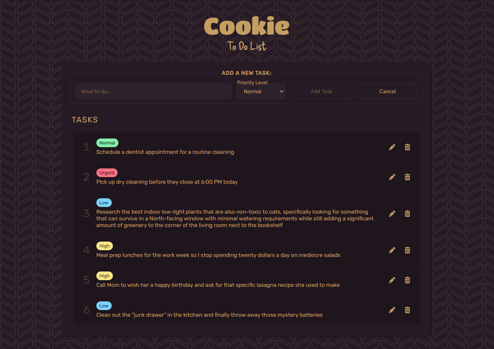
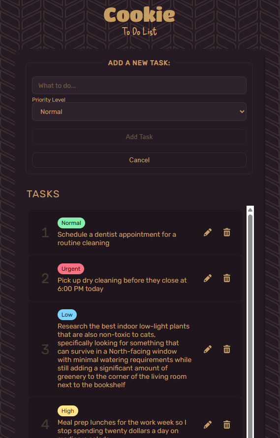

# Cookie: To Do List

## Overview
Cookie is a todo list app built with pure HTML, CSS, and JavaScript—no frameworks or CSS libraries. It demonstrates responsive design, custom theming, and interactive UI, all with native web technologies.

## Technologies/Styling
- JavaScript
- HTML
- CSS
- Hero Patterns
- Google Fonts

## Features
- CRUD for tasks: With inline editing of tasks.
- Task Prioritization: Assign and visually highlight priority levels (Low, Normal, High, Urgent) with color-coded badges by using dynamic classes.
- Local Storage: Tasks persist between sessions using browser localStorage.
- Responsive Layout: Flexbox and media queries ensure the app looks great on all screen sizes.
- crypto.randomUUID() method for the task id to help with errors of using the index of tasks.length.
- Validation: Enabling and disabling of add task button so you must have text in the input in order to add a new task.
- Custom Theming: Uses CSS variables for easy color and theme adjustments.
- No Frameworks: 100% native HTML, CSS, and JS—no Tailwind, Bootstrap, or external libraries.
- Modern UI: Clean, visually appealing design with custom fonts and subtle background patterns.

## How to Use
- Enter a task in the input field.
- Select a priority level.
- Click "Add Task" to add it to your list.
- Edit or delete tasks using the icons next to each item.
- Your tasks are saved automatically in your browser.

## Screenshots
Cookie on larger screens

Cookie on smaller screens

## Getting Started
Just open index.html in your browser. No build steps or dependencies required.

## Future Considerations for Improvements
- Modal for confirmation of permanent deletion of a task.
- Adding dates/timestamps and reminders.
- Completion and archiving tasks.
- Task filtering and search.